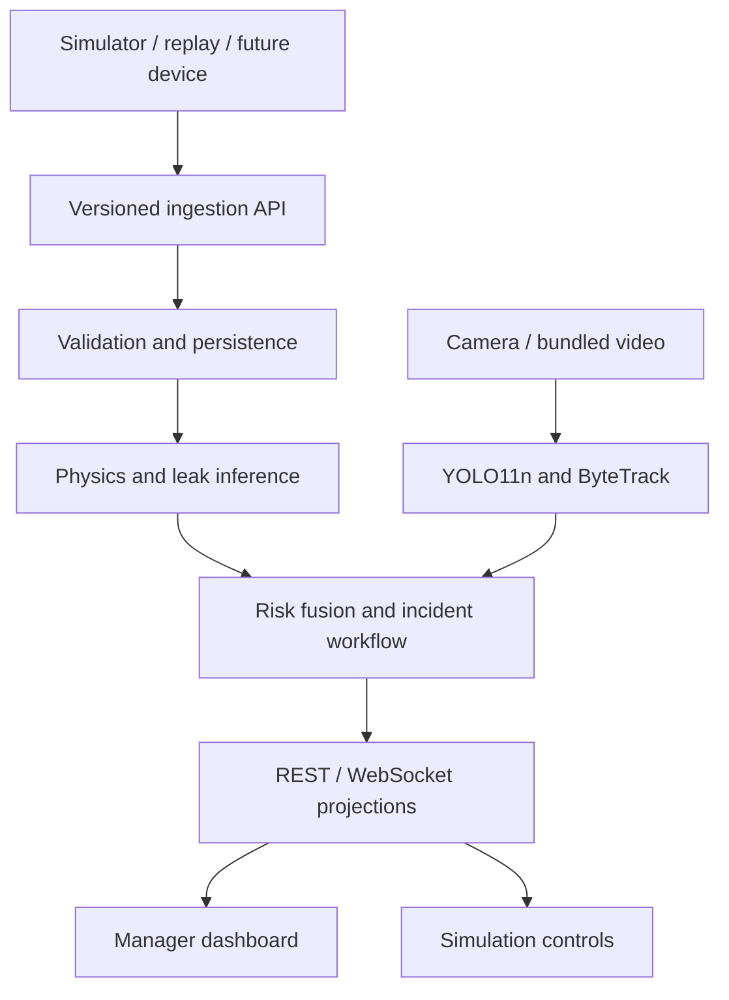

# Factory Safety Sentinel

## Mission

Build a cleanly runnable MVP for the **Smart-Facility Incident Detection System** assessment. It monitors one simulated factory workcell, predicts developing CO2 risk, observes workers and PPE from a real or replayed camera stream, calculates explainable incident severity, and supports human review through a simple live manager dashboard.

The submission is one complete, defensible vertical slice. Do not build disconnected model demos or a decorative dashboard.

## Definition of Done

`make demo` must start the database, backend, seeded simulator, bundled camera replay, model adapters, and frontend without credentials. A reviewer must be able to:

1. open a scenario that already contains ten simulated hours of sensor history;
2. start a gradual CO2 leak or reduce ventilation;
3. watch readings pass through the public ingestion contract and persistence layer;
4. see physics and ML predictions update for the next 60 minutes;
5. see an honest Time-to-Action result or `NO_CROSSING`;
6. move a worker into the affected zone or an overhead-work zone;
7. see actual camera/replay inference and separately labelled simulation ground truth;
8. see incident severity change for stated reasons;
9. acknowledge, investigate, comment on, and resolve the incident; and
10. reload the application and retain incidents, evidence, and the audit trail.

Every dashboard value must come from persisted backend state, a calculation, a model, or explicitly labelled simulation ground truth. The frontend must not invent live values, forecasts, incidents, or model status.

## Frozen Scope

### P0: implement and fully validate

- One factory workcell, one gas zone, one overhead-work zone, and one camera.
- CO2 as the fully validated gas profile.
- One controllable emission source and one controllable ventilation flow.
- Seeded sensor history, live readings, accelerated simulation time, reset, and replay.
- Sensor quality validation and deterministic threshold/exposure calculations.
- Physics concentration forecast and Time-to-Action.
- Calibrated XGBoost leak-probability model with rule/physics fallback.
- Fine-tuned YOLO11n detection of `person`, `helmet`, `vest`, and `no_helmet`.
- ByteTrack anonymous worker tracking and temporal PPE association.
- Worker-in-gas-zone and worker-in-overhead-zone rules.
- Explainable severity policy; confidence and severity remain separate.
- Human review workflow and immutable audit events.
- A simple two-route interface: `/dashboard` and `/simulation`.
- Structured logs, health/model status, automated tests, reproducible evaluation, setup documentation, architecture diagram, limitations, production-readiness notes, licence records, and AI-tool disclosure.

### P1: only after every P0 acceptance test passes

- CO as a second independently validated gas profile.
- Physics-informed GRU residual forecast with validation-derived uncertainty bounds.
- Sensor drift, stuck value, missing reading, delayed event, and camera outage controls.
- Multiple workers and machines.

### P2: document only

- Multiple zones/cameras and cross-camera identity.
- Facial recognition or named employee identity.
- Falling-object detection or trajectory prediction.
- Real PLC/MQTT/OPC-UA integrations or automatic equipment actuation.
- CFD, realistic gas plumes, collision physics, or a photorealistic digital twin.
- Distributed microservices, Kubernetes, or required cloud services.

An overhead danger zone is the P0 substitute for falling-tool prediction: the system warns when a tracked person without confirmed helmet compliance remains below configured overhead work. Do not claim that a fall is being predicted.

## Non-Negotiable Invariants

1. **One ingestion path:** simulator, replay, and future devices use the same versioned contracts.
2. **Evidence provenance:** use `SIMULATOR`, `REPLAY`, `CV_MODEL`, `SIMULATION_GROUND_TRUTH`, `PHYSICS_MODEL`, `ML_MODEL`, or `RULE` accurately.
3. **No fake CV:** simulator coordinates are never presented as detector output.
4. **Two clocks:** persist `event_time` and `ingested_at`; forecasting uses event time.
5. **Safe fallback:** threshold/exposure rules and physics forecasting work when learned artifacts fail.
6. **Severity is consequence:** model confidence never directly becomes incident severity.
7. **Human control:** recommended actions never operate real equipment.
8. **Privacy:** workers receive session-local anonymous track IDs; no facial recognition.
9. **Gas-specific policy:** thresholds, units, exposure windows, and actions come from a versioned profile.
10. **Reproducibility:** store model version/checksum, generator version, scenario seed, config version, and evidence references.
11. **Backend authority:** calculations, simulation state, incidents, and review transitions are authoritative in the backend.
12. **Honest degradation:** unavailable sensor/model/camera state is shown as degraded or unknown, never safe.

## Frozen Technology Choices

- **Backend:** Python 3.12, FastAPI, Pydantic v2, SQLAlchemy 2, Alembic, SQLite.
- **Sensor computation:** NumPy, pandas, SciPy, scikit-learn, XGBoost.
- **Sequence model when P1 begins:** PyTorch with a small GRU.
- **Vision:** Ultralytics YOLO11n, OpenCV, ByteTrack.
- **Frontend:** React, TypeScript, Vite, TanStack Query, Recharts, Three.js only on `/simulation`.
- **Live state:** WebSocket events plus REST history/commands; REST polling is the reconnect fallback.
- **Packaging:** Docker Compose and stable `make` commands.

Implement this as a modular monolith. Adapters are replaceable Python interfaces, not separate deployed services.

## Frozen Models

| Capability | P0 choice | Runtime output | Required fallback |
|---|---|---|---|
| Gas dynamics | Well-mixed mass-balance physics | 12 concentration points, threshold crossings | Last-value persistence plus current threshold rules |
| Leak likelihood | Calibrated `XGBClassifier` | Probability in `[0,1]`, label, feature snapshot | Explainable slope/source-consistency rule |
| Residual forecast | Not required for P0; specified GRU is P1 | 12 residual corrections and interval | Physics-only forecast |
| PPE/person vision | Fine-tuned YOLO11n at 640 px | Boxes for person/helmet/vest/no_helmet | Degraded camera state; simulator evidence remains separately labelled |
| Worker identity | ByteTrack | Session-local `track_id` | Frame evidence with `track_id=null` and reduced confidence |
| Risk/severity | Versioned deterministic policy | Severity, reason codes, recommendation | Current-threshold-only policy |

Do not silently replace these choices. A replacement needs a benchmark on the same held-out data, licence/runtime analysis, and an architecture decision record.

Detailed model parameters are in:

- [sensor model specification](.claude/skills/sensor-risk-modeling/references/model-specification.md)
- [vision model specification](.claude/skills/vision-worker-safety/references/model-specification.md)

## Logical Architecture



The detailed routes, tables, idempotency rules, and event payloads are in [API and data specification](.claude/skills/factory-system-architecture/references/api-and-data-specification.md).

## Domain Contracts

Implement versioned Pydantic models and generated or manually synchronized TypeScript equivalents.

### SensorReading

- `schema_version`, `reading_id`, `sensor_id`, `zone_id`, `scenario_id`
- `gas`, `value`, `unit`
- `event_time`, `ingested_at`, `source`, `quality`
- optional `sequence_number`, `correlation_id`, and fault metadata

### VisionEvidence

- `schema_version`, `evidence_id`, `camera_id`, `zone_id`
- `frame_id`, `event_time`, `ingested_at`, `source`, `model_version`
- anonymous `track_id`, detected class, confidence, normalized bounding box
- helmet/vest state, zone membership, and dwell duration where applicable
- `UNKNOWN` rather than false certainty when association is insufficient

### Forecast

- `forecast_id`, `zone_id`, `gas`, `generated_at`, `based_on_event_time`
- `model_version`, `model_status`, `horizon_minutes=60`, `step_minutes=5`
- 12 points containing physics baseline, optional learned residual, final value, lower/upper bounds
- leak probability, calibration version, feature snapshot reference
- time to internal action, NIOSH short-term, and NIOSH IDLH thresholds, or typed `NO_CROSSING`

### Incident

- `incident_id`, `type`, `zone_id`, optional `gas`, severity, confidence
- state, opened/updated/acknowledged/resolved timestamps
- deduplication key, reason codes, explanation, recommended action
- immutable references to readings, forecasts, and vision evidence
- `version` for optimistic concurrency

### AuditEvent

- `audit_id`, `actor`, action, timestamp, incident reference
- previous/new state, comment, request/correlation ID
- append-only; never update or delete from application workflows

## Gas Physics and Exposure

For a well-mixed zone with consistent units:

```text
dC/dt = Q/V * (Cin - C) + G/V
tau = V/Q
Css = Cin + G/Q
C(t) = Css + (C0 - Css) * exp(-t/tau)
t_threshold = -tau * ln((C_threshold - Css)/(C0-Css))
```

`C` and `Cin` are ppm, `V` is m3, `Q` is m3/hour, and the simulator stores `G` as ppm·m3/hour. Convert any physical mass/volume source in a dedicated unit layer before applying the equation.

P0 default configuration:

- zone volume: `1000 m3`;
- outdoor/inlet CO2: `450 ppm`;
- normal ventilation: `500 m3/hour`;
- normal time constant: `2 hours`;
- sensor cadence: one reading every five simulated minutes;
- UI stream cadence: at most one update per real second;
- lookback: ten simulated hours/120 points;
- forecast: 60 minutes/12 points.

Handle these typed outcomes: `ALREADY_EXCEEDED`, `CROSSING_EXPECTED`, `NO_CROSSING`, `INSUFFICIENT_DATA`, and `INVALID_PARAMETERS`. Never leak `NaN`, infinity, or an unhandled logarithm-domain error into JSON.

Use the NIOSH CO2 profile as the occupational reference for the prototype:

- TWA reference: `5000 ppm` over 8 hours;
- short-term reference: `30000 ppm` over 15 minutes;
- IDLH reference: `40000 ppm`.

The `5000 ppm` value is not an immediate-harm threshold. Calculate rolling exposure separately and call forecast crossings **Time-to-Action**, not time to harm. Keep an optional `1000 ppm` internal ventilation advisory visually and semantically separate from occupational limits. Store the source URL and access date with the profile: <https://www.cdc.gov/niosh/npg/npgd0103.html>.

## Vision and Worker Safety

P0 uses a YOLO11n checkpoint fine-tuned on the credential-free Ultralytics Construction-PPE dataset. Retain only the runtime classes needed by this system: `Person -> person`, `helmet`, `vest`, and `no_helmet`. The dataset also contains classes that are outside scope. Dataset details and licence must be documented: <https://docs.ultralytics.com/datasets/detect/construction-ppe>.

The detector must process a bundled video by default so the demo does not require a webcam. A webcam is an optional adapter. Record that YOLO11 code/weights use AGPL-3.0 unless a different licence is obtained: <https://docs.ultralytics.com/models/yolo11>.

Rules:

- map the bottom-centre of a person box to configured zone polygons;
- associate helmet/no-helmet with the upper person region and vest with the torso region;
- use timestamp-based dwell, not frame count alone;
- require persistent non-compliance before an incident;
- keep `UNKNOWN`, `COMPLIANT`, and `NON_COMPLIANT` distinct;
- never let a helmet reduce gas risk;
- never use a class called `unsafe_worker`;
- show camera/model failure as degraded;
- do not implement identity recognition or falling-object claims.

## Risk and Incident Policy

Severity is deterministic and versioned. The engine consumes current exposure, rolling exposure, forecast crossings, people/zone evidence, PPE evidence, and data quality.

| Condition | Severity | Required reason code |
|---|---|---|
| Internal ventilation advisory only | `LOW` | `CO2_VENTILATION_ADVISORY` |
| Forecast crosses 5000 ppm within 60 min; no person confirmed | `MEDIUM` | `CO2_ACTION_CROSSING_PREDICTED` |
| Same crossing with person in gas zone | `HIGH` | `PERSON_IN_PREDICTED_GAS_RISK` |
| 15-min average at/above 30000 ppm | `HIGH`; `CRITICAL` with person present | `CO2_SHORT_TERM_LIMIT` |
| Current or forecast 40000 ppm within 10 min | `CRITICAL` | `CO2_IDLH_NOW_OR_IMMINENT` |
| Missing helmet persists in overhead zone | `HIGH` | `PPE_HELMET_OVERHEAD_VIOLATION` |
| Missing vest persists in configured mandatory-PPE zone | `MEDIUM` | `PPE_VEST_VIOLATION` |
| Sensor disagreement/fault without corroboration | `LOW` data-quality incident | `SENSOR_UNRELIABLE` |
| Camera unavailable | degraded system status, not a safe scene | `CAMERA_DEGRADED` |

Use configurable dwell defaults: 2 seconds for zone membership, 3 seconds for helmet/vest non-compliance, and 5 seconds clear before resolving an observation. Deduplicate by `(incident_type, zone_id, gas_or_track_scope)` and update one incident rather than opening one per reading/frame.

Allowed workflow:

```text
OPEN -> ACKNOWLEDGED -> INVESTIGATING -> RESOLVED
OPEN -> RESOLVED
RESOLVED -> OPEN only through a new occurrence/reopen audit event
```

Every state/severity change must store reasons, actor (`SYSTEM` or human), old/new value, timestamp, correlation ID, and evidence references.

## Simple Manager Interface

Keep only two routes and no nested administration UI.

### `/dashboard`

1. Compact header: product name, scenario clock, connection indicator, simulation/replay badges.
2. Four status cards: overall risk, current CO2, Time-to-Action, people at risk.
3. Main row: gas history/forecast chart on the left and annotated camera on the right.
4. Active incident table below with severity, type, zone/track, age, state, and one `Review` action.
5. A side drawer for evidence, explanation, recommended action, comment, acknowledge/investigate/resolve, and audit history.

Do not add maps, analytics tabs, model-training controls, employee pages, or decorative gauges. The dashboard specification, empty/error/loading states, and exact chart series are in [dashboard specification](.claude/skills/factory-manager-dashboard/references/dashboard-specification.md).

### `/simulation`

- Low-poly/isometric view of one workcell.
- Controls: preset, start/pause/reset, speed, leak/source slider, ventilation slider, worker position, helmet, vest.
- P1 fault controls remain collapsed under `Advanced test controls`.
- Show simulation time and ground truth labels.
- Send commands to the backend; never calculate authoritative gas values in Three.js or React.

The simulator state machine and scenario values are in [simulator specification](.claude/skills/factory-digital-twin/references/simulator-specification.md).

## Reliability and Security Requirements

- Idempotent sensor ingestion by `reading_id`; duplicates return the original outcome.
- Reject invalid units, timestamps, negative flow/volume, impossible transitions, and unknown enum values with typed 4xx responses.
- Bound queues and inference work; dropping stale camera frames is preferable to growing delay.
- Model calls have timeouts and circuit-breaker/degraded status.
- WebSocket reconnect fetches a fresh REST snapshot before applying new events.
- SQLite uses migrations and transactional incident/audit writes.
- Logs are structured JSON with correlation IDs and no faces, names, credentials, or raw video frames.
- Bind locally by default, configure CORS explicitly, validate uploaded paths/types, and do not execute user filenames.
- On restart, recover open incidents and the latest simulation checkpoint; restarting must not erase audit history.

## Evaluation and Testing

Evaluate held-out scenario IDs/seeds, never random overlapping windows.

- **Physics:** analytical cases, numerical cases, unit conversions, every typed crossing result.
- **Leak model:** PR-AUC, precision/recall/F1, Brier score, reliability plot, false alarms per simulated hour, warning lead time.
- **Forecast:** MAE/RMSE, threshold-time error, and P1 interval coverage.
- **Vision:** per-class precision/recall/mAP, PPE-event F1, person/helmet recall, latency on declared CPU/GPU.
- **System:** critical-event recall, end-to-end alert latency, deduplication, state-transition correctness, audit completeness, restart recovery.
- **Resilience:** missing/stuck/noisy readings, duplicates/delay, unavailable model artifact, camera outage, WebSocket reconnect.

Unit tests must not require network, webcam, GPU, or wall-clock sleeps. Integration tests use temporary SQLite and deterministic fake clocks. The complete acceptance matrix is in [assessment acceptance matrix](.claude/skills/assessment-quality-gate/references/acceptance-matrix.md).

## Implementation Order

1. Contracts, settings, migrations, clocks, logging, health endpoints.
2. Simulator -> ingestion -> persistence with deterministic warm start.
3. Physics forecast, rolling exposure, Time-to-Action, unit tests.
4. Risk policy, incident lifecycle, audit events, WebSocket projection.
5. Functional dashboard using real APIs.
6. YOLO11n replay adapter, ByteTrack, PPE/zone evidence.
7. XGBoost training/evaluation and bundled artifact; verify fallback by removing it.
8. Low-poly simulation rendering and controls.
9. End-to-end, resilience, clean-environment, documentation, and demo rehearsal.
10. Only then consider the P1 GRU or second gas.

Keep every stage runnable. Do not begin P1 while a P0 acceptance case is broken.

## Required Commands and Artifacts

Expose stable commands:

- `make setup` installs/builds without credentials;
- `make demo` starts the complete seeded demo;
- `make test` runs unit and integration tests;
- `make e2e` runs browser/API acceptance tests;
- `make train-sensor` reproduces the XGBoost artifact;
- `make train-vision` documents/reproduces YOLO fine-tuning when the dataset is present;
- `make evaluate` reproduces reported metrics from bundled/credential-free inputs;
- `make lint` runs Python and TypeScript checks.

Bundle or reproducibly retrieve with checksum every artifact needed by `make demo`. Training is not part of demo startup. The demo must still run in degraded physics/rule mode if an ML artifact is deliberately unavailable.

## Assessment Documentation

- Keep the uploaded assessment and senior-project materials read-only.
- Include architecture, data flow, model cards, data cards, thresholds/sources, evaluation, failure modes, limitations, privacy/security, licences, cost, and production improvements.
- Explicitly disclose AI development tools and ensure the author can explain every dependency and decision.
- State that the prototype is not certified for real industrial safety decisions.
- State the synthetic-to-real and construction-to-factory domain gaps.
- Prefer measured P0 behavior to broad unfinished features.

## Intended Repository Structure

```text
.
|-- CLAUDE.md
|-- .claude/skills/
|   |-- factory-system-architecture/
|   |-- sensor-risk-modeling/
|   |-- vision-worker-safety/
|   |-- factory-manager-dashboard/
|   |-- factory-digital-twin/
|   `-- assessment-quality-gate/
|-- backend/
|   |-- app/api/
|   |-- app/contracts/
|   |-- app/domain/
|   |-- app/inference/
|   |-- app/simulation/
|   |-- app/storage/
|   `-- tests/
|-- frontend/
|   |-- src/dashboard/
|   |-- src/simulation/
|   |-- src/api/
|   `-- tests/
|-- models/
|   |-- artifacts/
|   |-- training/
|   |-- evaluation/
|   `-- registry.json
|-- scenarios/
|-- demo-assets/
|-- docs/
|-- scripts/
|-- docker-compose.yml
|-- Makefile
`-- README.md
```
