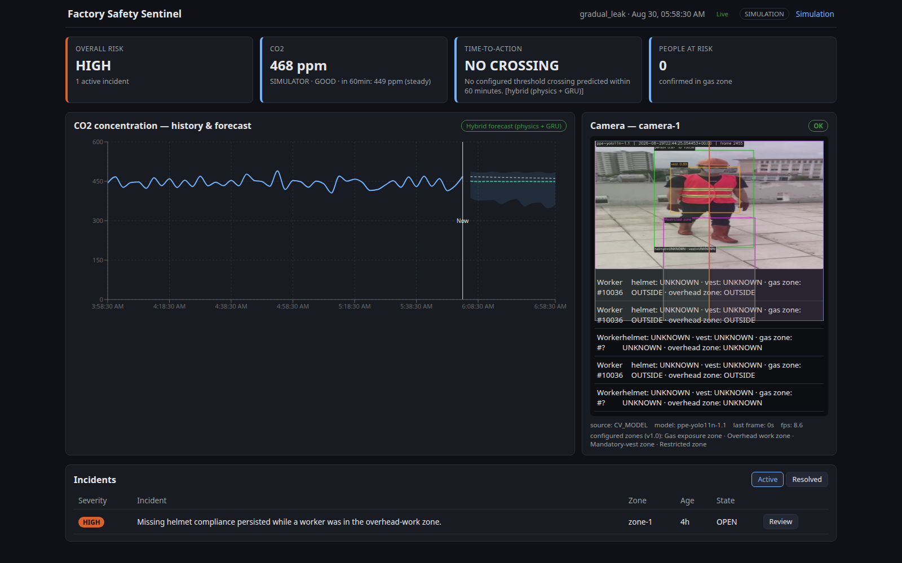
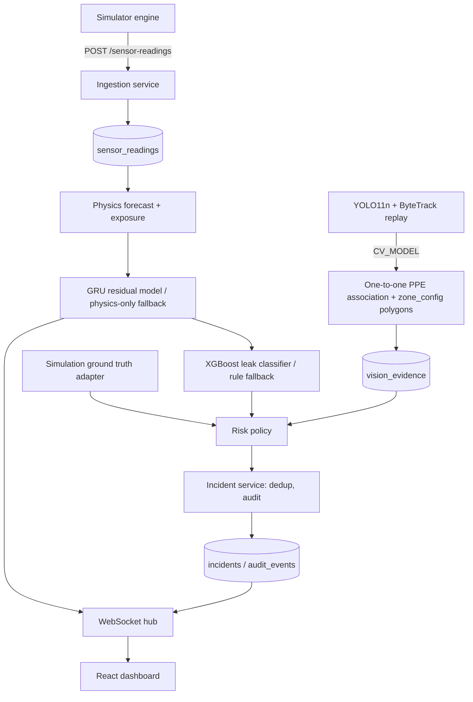
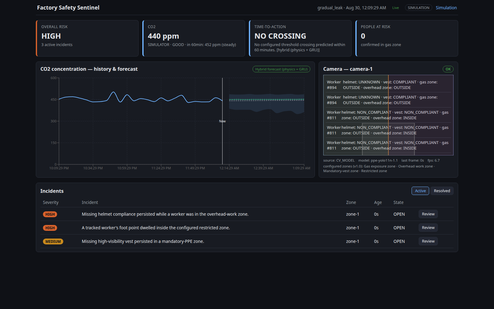
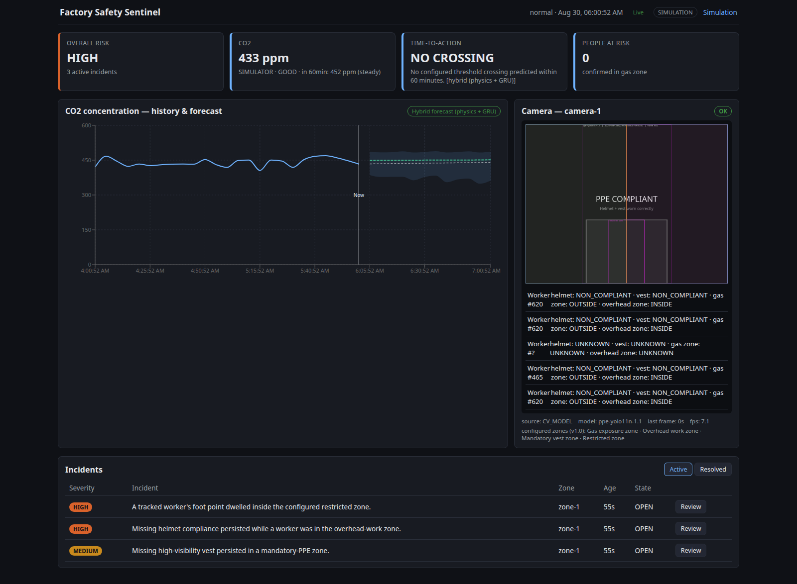
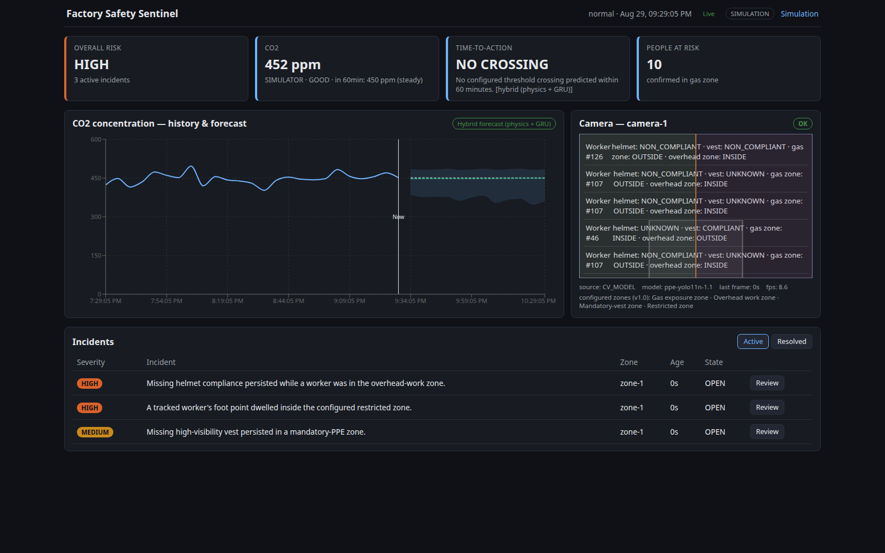
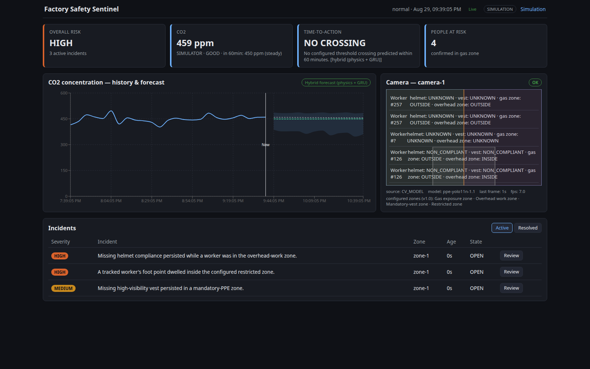
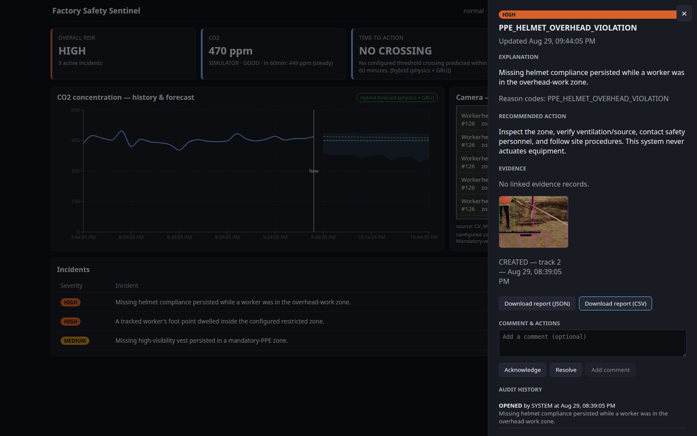
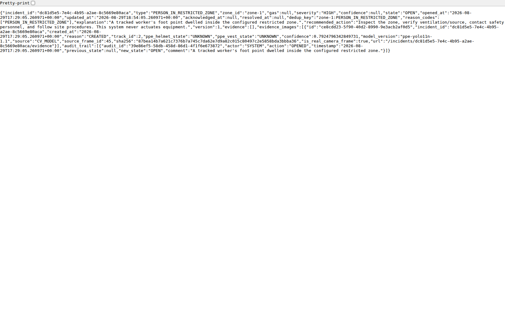
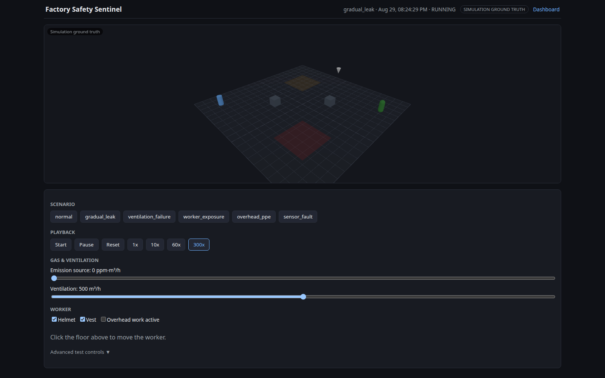
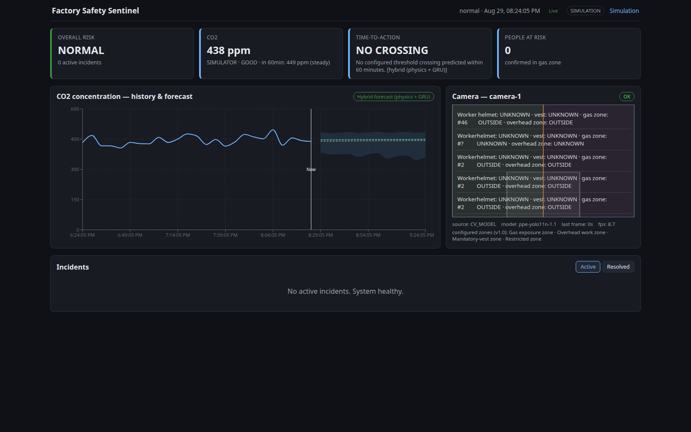

# Factory Safety Sentinel

**A predictive, multimodal smart-facility incident detection prototype.** Physics- and ML-driven CO2 gas-risk forecasting, fused with real-time YOLO11n/ByteTrack computer-vision PPE and restricted-zone supervision, into one explainable incident and human-review workflow — built on a deterministic, seeded factory-workcell simulator so every scenario is testable without physical hardware.

**Prototype for an assessment. Not certified for real industrial safety decisions.**



## Key features

- **Proactive gas-risk forecasting** — a well-mixed mass-balance physics model, sharpened by a residual GRU, reports a plain-language "Time-to-Action" estimate up to 60 minutes ahead, not just a threshold alarm.
- **Calibrated leak classification** — an XGBoost classifier over sliding-window sensor features, with a deterministic rule-based fallback if the model artifact is ever unavailable.
- **Real computer-vision PPE/zone supervision** — a fine-tuned YOLO11n detector (person/helmet/vest/no_helmet) tracked by ByteTrack, with one-to-one PPE association, timestamp-based dwell logic, and configurable restricted-zone polygons.
- **Explainable, deterministic incident policy** — severity and reason codes are traceable to a versioned rule table; model confidence is never presented as severity.
- **Full human review workflow** — Acknowledge → Investigate → Resolve, real captured evidence images, JSON/CSV incident reports, an append-only audit trail.
- **Digital twin** — a deterministic, seeded factory simulator uses the exact same ingestion and risk pipeline a real device would use, so every scenario is reproducible without a physical factory.
- **Genuine video demonstration** — a real, licensed, continuous video run through the live system, producing real database-backed incidents with real evidence (not a mockup).

## Quick start

```bash
make setup   # lean install (physics/rules only, no GPU/vision extras)
make demo    # starts backend (127.0.0.1:8000) and frontend (127.0.0.1:5173)
```

Open **http://127.0.0.1:5173/dashboard** and **http://127.0.0.1:5173/simulation** — no credentials or cloud services required.

For real camera inference and the hybrid GRU forecast:

```bash
make setup-vision   # adds ultralytics/opencv/torch
make demo
```

### Interview demonstration

Runs the genuine end-to-end sequence — real video → real detection → real incident → real evidence → real review — against a real backend, and shuts down cleanly:

```bash
make interview-demo        # scripted verification run
make interview-demo-e2e     # Playwright end-to-end test against the same flow
```

Video link: [`deliverables/Factory_Safety_Sentinel_Interview_Demo.mp4`](deliverables/Factory_Safety_Sentinel_Interview_Demo.mp4) — full screen recording of the real sequence. Source/annotated clips: [`demo-assets/interview_compilation_source.mp4`](demo-assets/interview_compilation_source.mp4), [`demo-assets/interview_compilation_annotated.mp4`](demo-assets/interview_compilation_annotated.mp4).

## Architecture



## Models — exactly three trained, one analytical

| Component | Type | Role |
|---|---|---|
| XGBoost leak classifier | Trained ML | Calibrated leak-probability estimate |
| Residual GRU forecast | Trained ML | Sharpens the 60-min physics forecast |
| YOLO11n PPE detector | Trained CV model | Detects person/helmet/vest/no_helmet |
| Physics mass-balance model | Analytical, not ML | Gas concentration forecast, safe fallback |
| ByteTrack | Tracking algorithm, not trained | Anonymous worker tracking |
| Restricted-zone polygons | Deterministic geometry | Zone membership, not a learned class |
| Risk/severity policy | Deterministic logic | Versioned, explainable incident decisions |

## Final results

| Metric | Value | Source |
|---|---|---|
| Hybrid forecast improvement (matched benchmark, n=1092) | 57.19 → **47.59 ppm MAE** (**16.8%**) | `models/evaluation/gru_benchmark_report.json` |
| Broader physics-only eval (10 scenarios, 120 points) | 95.50 ppm MAE | `models/evaluation/physics_forecast_metrics.json` — a separate set, never compared directly to the figure above |
| Leak classifier (calibrated XGBoost) | 0.965 PR-AUC, 0.022 Brier | `models/evaluation/leak_model_metrics.json` |
| Active PPE detector (v1.1) | mAP50 0.559, mAP50-95 0.276 | `models/evaluation/vision_model_metrics.json` |
| v1.2 candidate (second dataset, 7/50 epochs) | **Rejected** by the promotion gate | `models/registry.json` → `ppe_detector.rejected_experiments` |
| Backend tests | **173 passing** | `backend/tests/` |
| Frontend tests | **18 passing** | `frontend/tests/` |
| Playwright e2e | **2/2 suites passing** | `frontend/tests/e2e/` |

Full detail: [`docs/FINAL_PROJECT_REPORT.md`](docs/FINAL_PROJECT_REPORT.md).

## Screenshot gallery

| | |
|---|---|
|  Dashboard — normal state |  Dashboard — predictive gas-risk state |
|  Camera — PPE compliant |  Missing-helmet alert |
|  Restricted-zone intrusion |  Incident table |
|  Review drawer — real evidence frame |  JSON/CSV report |
|  Simulation — overview |  Simulation — gas controls |
|  Simulation — worker movement |  System status |

## Testing

```bash
make test              # backend pytest (173 tests) + frontend vitest (18 tests)
make e2e                 # Playwright smoke test against the standard dashboard flow
make interview-demo-e2e   # Playwright e2e against the real interview-demo flow
make lint                  # ruff + oxlint + generated-API-type drift check
make evaluate                # reproduces physics/leak/vision/system metrics
make evaluate-forecast         # physics-vs-hybrid GRU benchmark
```

## Repository structure

```text
.
├── backend/           # FastAPI, domain logic, inference adapters, 173 tests
├── frontend/           # React/TypeScript dashboard + Three.js simulation, 18 tests + e2e
├── models/               # artifacts, evaluation reports, registry.json
├── demo-assets/           # bundled replay clips, interview video, source documentation
├── deliverables/           # final report, presentation, interview-demo video
├── docs/                     # FINAL_PROJECT_REPORT.md, README.md, ADRs, acceptance results
└── scenarios/                 # scenario documentation
```

## Limitations

- The PPE detector's `no_helmet` class remains weak (17.5% recall on the held-out benchmark; it does not clear its runtime threshold at all on real interview footage — a disclosed domain-gap finding).
- Vision model trained on construction-site imagery, not a real factory; no real deployed-factory validation data exists for the sensor pipeline either.
- The interview-demonstration video is one compilation from one licensed source clip — a demonstration, not a held-out evaluation set.
- SQLite/single-process, appropriate for this demo's scale, not a production deployment.
- No safety certification. This prototype must not inform real evacuation, ventilation, or industrial-safety decisions.

Full detail: [`docs/FINAL_PROJECT_REPORT.md` §16](docs/FINAL_PROJECT_REPORT.md#16-limitations).

## Dataset and video attribution

- **Ultralytics Construction-PPE** dataset (AGPL-3.0) — v1.0/v1.1 PPE detector training and evaluation.
- **Industrial Safety** dataset (Roboflow Universe, MIT license) — v1.2 candidate training only (candidate was rejected; v1.1 remains active).
- **Interview-demonstration clip** — the submitter's own recording, explicitly cleared for redistribution (`demo-assets/INTERVIEW_VIDEO_SOURCES.md`).
- **Natural-motion stress-test clip** — Pexels video ID 5434220 by Everett Bumstead, commercial use and modification permitted, no attribution required (`demo-assets/NATURAL_MOTION_SOURCE.md`).

## Report and presentation

- [`docs/FINAL_PROJECT_REPORT.md`](docs/FINAL_PROJECT_REPORT.md) — full written report
- [`deliverables/Factory_Safety_Sentinel_Final_Report.pdf`](deliverables/Factory_Safety_Sentinel_Final_Report.pdf) / [`.docx`](deliverables/Factory_Safety_Sentinel_Final_Report.docx)
- [`deliverables/Factory_Safety_Sentinel_Final_Presentation.pdf`](deliverables/Factory_Safety_Sentinel_Final_Presentation.pdf) / [`.pptx`](deliverables/Factory_Safety_Sentinel_Final_Presentation.pptx) — 18-slide deck, 12–15 minute presentation
- [`deliverables/Factory_Safety_Sentinel_Speaker_Notes.md`](deliverables/Factory_Safety_Sentinel_Speaker_Notes.md)

Full technical documentation — architecture, model cards, evaluation results, licenses, security/privacy, and AI-tool disclosure — is in [`docs/README.md`](docs/README.md). Product scope and non-negotiable invariants are in [`CLAUDE.md`](CLAUDE.md).
