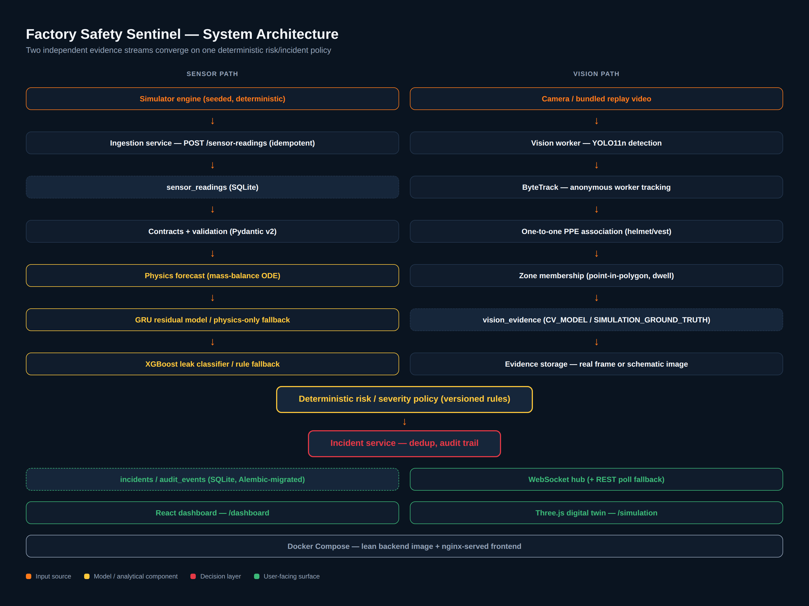
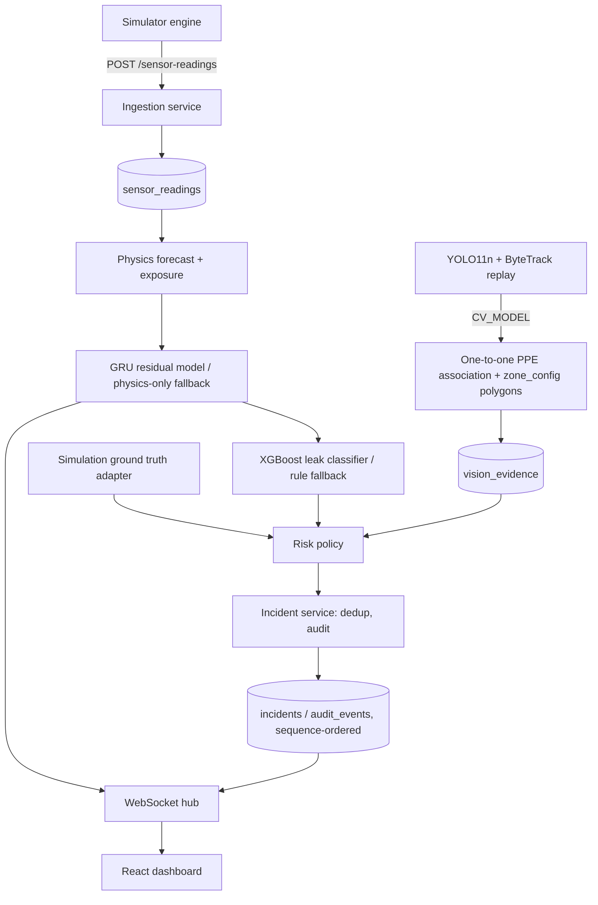
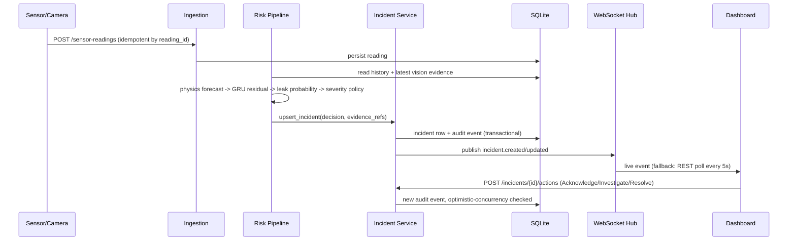

# Factory Safety Sentinel — Final Project Report

**Smart-Facility Incident Detection System: a predictive, multimodal industrial-safety prototype**

---

## 1. Cover Page

- **Project title:** Factory Safety Sentinel — Smart-Facility Incident Detection System
- **Assessment / module:** Smart-Facility Incident Detection System assessment (as specified in `CLAUDE.md`, the project's authoritative scope document)
- **Prepared by:** Factory Safety Sentinel assessment submission. No individual student or team name string exists anywhere in this repository's history or documentation; contact for this submission is `mohammad.2003.1m@gmail.com`. This is stated honestly rather than inventing a name or institution not present in the source material.
- **Institution:** Not recorded in the repository — not invented here.
- **Submission date:** 2026-08-29
- **Repository URL:** https://github.com/M7mdknh/smart-detector

**Status:** Prototype for an assessment. **Not certified for real industrial safety decisions.**

---

## 2. Executive Summary

Factory Safety Sentinel is a working, end-to-end prototype for a smart-facility incident detection system covering one simulated factory workcell. It combines two independent evidence streams — gas sensors and a camera — into one explainable incident and human-review workflow:

- **Sensor side:** a well-mixed mass-balance physics model forecasts CO2 concentration 60 minutes ahead; a physics-informed residual GRU sharpens that forecast; a calibrated XGBoost classifier estimates leak probability from sliding-window sensor features. Every learned component has a deterministic fallback and never blocks ingestion if unavailable.
- **Vision side:** a YOLO11n detector fine-tuned for `person`/`helmet`/`vest`/`no_helmet`, tracked by ByteTrack, feeds a one-to-one PPE-association algorithm and timestamp-based dwell logic against configured zone polygons (gas-exposure, overhead-work, mandatory-vest, restricted).
- **Decision layer:** a deterministic, versioned severity policy converts sensor and vision evidence into incidents with reason codes, deduplicated and audit-logged — model confidence is never presented as severity.
- **Dashboard:** a two-route manager interface (`/dashboard`, `/simulation`) shows live gas trend/forecast, camera detections, an incident table, and a review drawer with real evidence, JSON/CSV reports, and an Acknowledge → Investigate → Resolve workflow.
- **Digital twin:** a deterministic, seeded factory simulator lets every scenario be tested without physical hardware, through the exact same ingestion and risk pipeline a real device would use.

**This session's final results:** the GRU residual correction reduces forecast MAE by 16.8% (57.19 → 47.59 ppm, matched n=1092 benchmark); the calibrated XGBoost leak classifier reaches 0.965 PR-AUC / 0.022 Brier; the active PPE detector (v1.1) reaches 0.559 mAP50; a genuine second-dataset fine-tuning attempt (v1.2) was evaluated and **honestly rejected** by a mechanical promotion gate; a real, licensed, continuous interview-demonstration video was sourced, compiled, and run through the live system, producing three genuine, database-backed incidents (`PPE_HELMET_OVERHEAD_VIOLATION`, `PERSON_IN_RESTRICTED_ZONE`, `PPE_VEST_VIOLATION`) with real captured evidence frames, real audit trails, and real downloadable reports. 173 backend tests and 18 frontend tests pass; two Playwright end-to-end suites pass; the acceptance matrix records 27 of 30 total cases as PASS and 3 as PASS WITH LIMITATION, 0 FAIL.

**Main limitations, stated directly:** the PPE detector's `no_helmet` class remains weak (17.5% recall on the held-out benchmark, and it never clears its runtime threshold at all on the real interview video — a genuine, disclosed domain-gap finding); the vision model is trained on construction-site imagery, not a real factory; there is no real deployed-factory validation data for either the sensor or vision pipeline; and the system carries no safety certification. None of this is hidden — it is the subject of Sections 16 and the Limitations slide of the accompanying presentation.

---

## 3. Assessment Requirements and Scope Alignment

### 3.1 Why a focused factory scope was selected

`CLAUDE.md` (the project's frozen scope document) explicitly restricts P0 to **one workcell, one gas zone, one overhead-work zone, one camera**, fully implemented and tested, over a broader but shallower multi-zone/multi-camera/multi-gas system. The rationale, preserved from the project's own scope decisions: "The submission is one complete, defensible vertical slice. Do not build disconnected model demos or a decorative dashboard." A narrow, completely working slice is more defensible under assessment scrutiny than a wide surface with partially-working corners, and it keeps every claim in this report backed by an actual, currently-passing test or a live, reproducible run.

### 3.2 Traceability table

| Assessment requirement | Implemented component | Evidence | Test(s) | Screenshot | Documentation |
|---|---|---|---|---|---|
| Sensor-based risk monitoring | Seeded CO2 simulator + ingestion pipeline | `backend/app/simulation/`, `backend/app/services/ingestion.py` | `test_simulation_determinism.py`, `test_ingestion.py` | `01_dashboard_normal_state.png` | §6, §13 below |
| Predictive gas-risk forecasting | Physics mass-balance + residual GRU + physics fallback | `backend/app/domain/physics/`, `models/artifacts/forecast-gru.pt` | `test_forecast_gru.py` (10 cases), `test_physics_*.py` | `02_dashboard_predictive_gas_risk_state.png` | §7, §8 |
| Leak-probability classification | Calibrated XGBoost classifier + rule fallback | `models/artifacts/leak-classifier-xgb.json` | leak-model fallback tests | — | §7, §8 |
| Computer-vision PPE/zone supervision | YOLO11n + ByteTrack + one-to-one PPE association | `backend/app/inference/vision_worker_impl.py`, `ppe_association.py` | `test_vision_e2e.py`, `test_ppe_association.py` (10 scenarios), `test_vision_association.py` | `03_camera_correct_ppe.png`, `04_missing_helmet_alert.png` | §9 |
| Working manager dashboard | React/TypeScript `/dashboard` route | `frontend/src/dashboard/` | `dashboard.e2e.mjs` | `12_dashboard.png` | §11 |
| Fully functioning backend | FastAPI + SQLAlchemy + Alembic + SQLite + WebSocket | `backend/app/` | 173 backend tests | — | §13 |
| Simulation / digital twin | Three.js `/simulation` route, same ingestion path | `frontend/src/simulation/`, `backend/app/simulation/engine.py` | `test_simulation_determinism.py`, `test_restricted_zone.py` | `09_simulation_overview.png`–`11_simulation_worker_movement.png` | §12 |
| Evidence and incident workflow | Incident service, evidence capture, audit trail | `backend/app/services/incident_service.py`, `evidence_image.py` | `test_incident_workflow.py`, `test_incident_evidence_images.py` | `06_incident_table.png`, `07_incident_review_drawer_real_frame.png` | §11 |
| Restricted-zone intrusion detection | Configured polygon + foot-point + dwell | `backend/app/inference/zone_config.py` | `test_restricted_zone.py` (5 tests) | `05_restricted_zone_intrusion.png` | §9 |
| Genuine continuous-video demonstration | Real licensed interview clip run through the live pipeline | `demo-assets/interview_compilation_source.mp4` | `interview-demo.e2e.mjs` | `evidence_*.jpg` (3 real frames) | §10 |
| Reproducible evaluation | Programmatic metric assertions at report/slide build time | `scripts/presentation/build_slides.py` | — | — | §8, §9 |
| Human review workflow | Acknowledge → Investigate → Resolve, optimistic concurrency | `backend/app/api/routes.py` | `test_incident_workflow.py` | `08_json_csv_report_result.png` | §11 |
| Docker deployment | `docker-compose.yml`, lean backend image | `backend/Dockerfile`, `frontend/Dockerfile` | Docker build/up/down (docs/FINAL_VERIFICATION.md) | — | §13 |
| No fake CV / honest provenance | `SIMULATION_GROUND_TRUTH` vs `CV_MODEL` never conflated | `backend/app/services/vision_ground_truth.py` | `test_vision_e2e.py::test_real_detector_produces_person_and_ppe_evidence` | — | §9 |
| Safe fallback for every model | Physics-only, rule-based leak, `ModelStatus.UNAVAILABLE` | `backend/app/inference/*` | `test_forecast_gru.py`, `test_vision_model_availability.py` | — | §7, §9 |

**Acceptance status:** 27 of 30 total acceptance-matrix rows (A01–A18, E01–E12) PASS; 3 PASS WITH LIMITATION; 0 FAIL. Full detail in Appendix A and `docs/ACCEPTANCE_RESULTS.md`.

---

## 4. Problem Analysis

**Gas leakage and air-quality risk.** CO2 accumulation in an enclosed workcell can develop gradually over tens of minutes as ventilation degrades or an emission source increases — a trend that is easy for a human to miss between spot-checks, and a threshold-only alarm only fires *after* the danger point is already reached.

**Reactive versus proactive safety systems.** Most facility monitoring is reactive: a reading crosses a fixed threshold, an alarm sounds. This system instead forecasts 60 minutes ahead and reports a plain-language "Time-to-Action" estimate, so a manager can intervene before a threshold crossing, not after.

**PPE compliance.** A worker without a helmet or hi-vis vest in a hazard area is a preventable risk that is only caught if a supervisor happens to be looking at the right moment. Continuous, evidence-backed visual supervision closes that gap.

**Restricted zones.** Some areas require workers to stay out entirely (near active machinery, a hazard boundary). Continuous human supervision of a zone boundary does not scale across a shift; a camera with configured zone polygons does.

**Fragmented monitoring.** Sensors, cameras, and incident logs are typically separate systems with no correlation between a gas trend, a camera event, and a reviewable record. This project unifies all three behind one ingestion contract and one incident/audit model.

**Need for evidence and audit trails.** A safety incident that cannot be reviewed after the fact — what evidence triggered it, who acknowledged it, when it was resolved — is not defensible to a regulator or an internal safety review. Every incident here carries reason codes, linked evidence (real captured frames where genuinely available, or an explicitly labelled schematic reconstruction otherwise), and an append-only audit trail.

**Lack of access to a real factory.** No physical factory, real sensor hardware, or real factory camera feed was available for this assessment. This is addressed directly by building a deterministic, seeded digital twin that exercises the *identical* ingestion and risk pipeline a real device would use (§12), and by sourcing genuine real-world video for the vision pipeline specifically (§10) rather than only ever testing against synthetic or simulator-rendered imagery.

---

## 5. Decision History and Rationale

Every decision below reflects an actual choice made and preserved in the repository's commit history, ADRs, or model registry — not a retrospective justification invented for this report.

**Factory scope instead of a broad workplace-safety scope.** See §3.1 — `CLAUDE.md`'s explicit "one complete, defensible vertical slice" decision.

**Combined sensors and cameras instead of CV-only monitoring.** Gas risk is not visually observable; PPE/zone risk is not detectable from sensor readings. A single-modality system would leave one entire hazard category unaddressed. The two streams are kept architecturally independent (separate evidence tables, separate provenance labels) but converge on one deterministic risk policy.

**Simulation/digital twin because no factory was available.** See §12 — the simulator uses the exact same `POST /sensor-readings` ingestion path and the exact same risk pipeline a real device would use (CLAUDE.md invariant #1), so it is a legitimate test harness, not a decorative visualization; the project's own automated test suite runs against it directly.

**Physics-informed prediction instead of pure black-box forecasting.** A pure ML forecaster has no guaranteed fallback if its artifact is missing or corrupted, and its output cannot be explained to a manager in physical terms. The well-mixed mass-balance ODE is always available, is physically interpretable ("CO2 may reach the action reference in 34 minutes" is derived from a real equation, not a black box), and the GRU is layered on top as a *residual* correction, never a replacement.

**Residual GRU instead of a fully independent sequence model.** Learning only the physics model's residual error is a smaller, better-conditioned target than learning to predict CO2 concentration outright from a synthetic dataset — the physics baseline already captures the dominant, well-understood dynamics, so the GRU's job is narrower and less prone to overfitting on a modest training set.

**GRU instead of LSTM.** A GRU has fewer gates and parameters than an LSTM (no separate cell state), which reduces overfitting risk on this project's relatively small synthetic training set and lowers inference latency — measured at 1.90ms median / 2.41ms p95 per forecast, well under the 5-minute sensor cadence budget. The residual-correction task does not require LSTM's extra long-range-memory capacity.

**XGBoost for leak classification.** The leak classifier's inputs are engineered, tabular sensor features (rolling means/stds, slopes, deviation from the physics baseline) — exactly the regime where gradient-boosted trees reliably outperform linear models. Measured here: 0.965 PR-AUC vs. 0.941 for logistic regression on the same held-out set, with XGBoost's main measured advantage after calibration being probability quality (Brier 0.022 vs. 0.029), not raw discrimination.

**YOLO11n for edge-friendly detection.** The "n" (nano) size variant was chosen specifically to sustain real-time inference (88 FPS achieved in this project's own evaluation) on the available hardware — an NVIDIA GeForce MX450, a 2GB-VRAM laptop GPU, not a data-center accelerator.

**Model size balanced against MX450 hardware.** AMP (automatic mixed precision) training produced NaN losses from the first batch on this GPU — a real numerical-stability issue confirmed by a 2-epoch dry run — so training ran with `amp=false`, and the "n" model size was chosen (over "s"/"m") specifically so full-precision training and 640px real-time inference both fit within the 2GB VRAM budget.

**ByteTrack kept separate from detection.** Tracking (associating detections into persistent anonymous IDs across frames) and detection (finding objects in one frame) are different problems with different failure modes; keeping them as separate stages means a tracker failure degrades to `track_id=None` (still usable, single-frame evidence) rather than silently corrupting detection quality.

**Restricted zones as polygons, not an ML class.** A "restricted zone" is a *configuration* choice (where the boundary is), not a visual pattern to learn — there is nothing in the pixels of a restricted area that a classifier could distinguish from a normal area. Geometric point-in-polygon testing against a real tracked foot-point is deterministic, instantly reconfigurable without retraining, and auditable.

**Deterministic risk policy kept outside ML.** CLAUDE.md invariant #6: model confidence must never directly become incident severity. A versioned, deterministic rule table means every incident's severity and reason codes are traceable to an explicit, reviewable rule — not an opaque score a regulator or safety reviewer cannot inspect.

**One additional external dataset chosen (Industrial Safety, Roboflow Universe, MIT license).** The original Construction-PPE dataset's `no_helmet` class was identified as the weak point (0.175 recall) after the v1.0→v1.1 continuation-training pass already exhausted what more epochs on the *same* data could deliver — a genuinely independent, MIT-licensed, credential-free dataset was the next lever to pull, selected specifically because its class schema (hardhat/no_hardhat/person/safety_vest) maps cleanly onto this project's canonical four classes with no invented mapping.

**Why other datasets were rejected or deferred.** `docs/adr/0002-vision-v2-roadmap.md` documents four additional datasets considered for a broader two-stage architecture (a person-detector stage plus a PPE-item stage) — none were acquired in this pass; the ADR records this as a deliberate scope-down decision (GPU/credential/licensing constraints at the time it was written), revisited later in this session once GPU access and a genuinely licensed dataset were actually available, but the two-stage architecture itself remains future work, not executed.

**Hosted Roboflow inference considered, local inference retained.** A hosted third-party inference endpoint was not used for the production pipeline: it would violate this project's reproducibility and "no fake CV" invariants (the exact model version and weights checksum must be owned and auditable, evaluated against a fixed artifact under the project's own control) and would make the demo depend on network access and a third party's continued availability, which conflicts with the "no credentials, fully offline demo" requirement.

**Fine-tuned the existing checkpoint instead of replacing the entire vision system.** The v1.0→v1.1 continuation-training and the v1.2 candidate were both targeted, incremental changes to one detector artifact, evaluated against a fixed promotion gate — not a wholesale architecture replacement — because CLAUDE.md explicitly requires "a benchmark on the same held-out data, licence/runtime analysis, and an architecture decision record" before *any* replacement of a frozen model choice, and no such record was produced to justify a full replacement.

**Explicit evidence images and reports added.** A severity number alone is not reviewable; a manager or auditor needs to see *what* was observed. Every eligible incident captures one annotated evidence image (real camera frame when genuinely available and licensed for it, else a clearly labelled schematic reconstruction — never presented as an unlabelled camera capture) plus a downloadable JSON/CSV report.

**Missing-model fallback must never download silently.** `load_model()` verifies the configured artifact's path and SHA-256 against the registry *before* ever constructing a YOLO object, and never loads a bare pretrained-name string (which would trigger an automatic network download of a non-fine-tuned model) — a missing or corrupt artifact returns `ModelStatus.UNAVAILABLE` with zero network calls, verified by a dedicated test suite that blocks the socket layer during the test.

**Camera and detector health kept independent.** The bundled video can decode fine while the fine-tuned model artifact is missing or corrupt, and vice versa; conflating the two into one status field would hide which specific failure occurred. `camera_status` and `detector_status` are separate fields on the vision worker, surfaced independently through `/system/status`.

**Docker included.** A reviewer needs to be able to run the system without trusting the host machine's exact Python/Node toolchain; Docker Compose proves the backend and frontend build and run cleanly from a declared, reproducible environment, and was actually built and run end-to-end (not merely written) during the project's verification passes.

**Dashboard kept simple.** CLAUDE.md explicitly forbids "maps, analytics tabs, model-training controls, employee pages, or decorative gauges" — two routes only (`/dashboard`, `/simulation`), because a manager-facing safety tool that requires training to navigate defeats its own purpose, and every additional surface is another place a value could be silently fabricated instead of traced to the backend.

---

## 6. System Architecture



The rendered diagram above is the authoritative reference for PDF/DOCX readers; the equivalent Mermaid source below renders natively on GitHub's web view of this file.



**Sequence — one incident, end to end:**



**Module boundaries** (`backend/app/`): `contracts/` (versioned Pydantic v2 models — the one ingestion/API contract), `domain/physics`, `domain/exposure`, `domain/risk` (pure functions, fully unit-tested in isolation), `simulation/` (deterministic scenario engine, talks to the rest of the system only through `services/ingestion.py`), `services/` (ingestion, forecast, incident dedup/workflow, the pipeline orchestrator, the WebSocket hub, the ground-truth vision adapter), `inference/` (XGBoost leak-model adapter with rule fallback, YOLO11n/ByteTrack vision adapter, frame annotation, frame cache), `api/` (FastAPI routes, WebSocket endpoint, typed error handling), `storage/` (SQLAlchemy models + Alembic migrations).

**Frontend** (`frontend/src/`): `dashboard/` (StatusCards, GasChart, CameraPanel, IncidentTable, ReviewDrawer), `simulation/` (ThreeScene, SimulationPage), `api/` (typed REST client + generated OpenAPI types), `lib/` (WebSocket hook with reconnect/resync).

**Deployment:** `docker-compose.yml` builds a lean backend image (`backend/Dockerfile`, no vision/torch extras — kept small and GPU-independent) and a static frontend served by nginx (`frontend/Dockerfile`, `frontend/nginx.conf` with SPA fallback routing).

---

## 7. Sensor Modelling

**Well-mixed mass balance** (a single ODE governing concentration in a well-mixed zone):

```
dC/dt = Q/V * (Cin - C) + G/V
```

where `C` is the current zone concentration (ppm), `Cin` is the inlet/outdoor concentration (ppm), `V` is zone volume (m³), `Q` is ventilation flow (m³/hour), and `G` is the emission source rate (ppm·m³/hour, converted from any physical mass/volume source in a dedicated unit layer).

**Steady-state concentration** — the concentration the zone would eventually settle at under constant conditions:

```
Css = Cin + G/Q
```

**Time constant** — how quickly the zone approaches steady state:

```
tau = V/Q
```

**Concentration response** — the closed-form solution to the ODE given an initial concentration `C0`:

```
C(t) = Css + (C0 - Css) * exp(-t/tau)
```

**Time-to-Action** — solved for the time `t` at which concentration reaches a given threshold `Cthresh`:

```
t = -tau * ln((Cthresh - Css) / (C0 - Css))
```

Deliberately named **Time-to-Action**, never "time to harm": the NIOSH 5000 ppm reference used as the default action threshold is an 8-hour time-weighted-average occupational reference, not an immediate-harm line. Typed outcomes (`ALREADY_EXCEEDED`, `CROSSING_EXPECTED`, `NO_CROSSING`, `INSUFFICIENT_DATA`, `INVALID_PARAMETERS`) prevent `NaN`/infinity/unhandled-logarithm errors from ever reaching the API.

**Risk thresholds** (NIOSH CO2 profile, source: https://www.cdc.gov/niosh/npg/npgd0103.html, accessed 2026-08-28, profile version 1.0): TWA 5000 ppm/8h, short-term 30000 ppm/15min, IDLH 40000 ppm. An internal-only 1000 ppm ventilation advisory is kept visually and semantically separate from the occupational references.

**XGBoost leak classifier:** a 200-tree `XGBClassifier` (max depth 3) trained on 17 leakage-safe sliding-window features (current value, 5/15/30-minute deltas, robust slopes, rolling mean/std, deviation from a no-leak physics baseline, ventilation state, missing-data fraction) computed at each cutoff time. Sigmoid (Platt) calibration is fit on a held-out validation split (never test) and applied at inference time.

**Hybrid residual GRU:** a 1-layer `nn.GRU(input_size=7, hidden_size=32)` followed by a linear head producing 12 residual outputs (one per 5-minute step of the 60-minute horizon). `combined_forecast = physics_baseline + gru_residual`; physics, residual, combined, and empirical `[q05, q95]` error bounds are persisted as separate fields on every forecast point, never collapsed into one number.

**Physics fallback:** whenever `gru_status != OK` (missing registry entry, missing/corrupt artifact, SHA-256 mismatch, feature-schema mismatch, inference timeout, or non-finite output), the forecast silently and correctly degrades to physics-only — verified by 10 automated fallback test cases and confirmed live against the vision-dependency-free Docker backend, where `torch` is not installed at all.

---

## 8. Forecasting Results

Two evaluation sets are used in this project and are **never conflated**:

### 8.1 Matched held-out GRU benchmark (`models/evaluation/gru_benchmark_report.json`)

Identical held-out scenario/point set scored against both the physics-only and hybrid forecasts:

| Metric | Physics-only | Hybrid (physics + GRU) |
|---|---|---|
| MAE (global, n=1092) | **57.19 ppm** | **47.59 ppm** |
| Improvement | — | **16.8%** |

Per-category MAE (physics → hybrid): normal 19.9→15.8, gradual leak 83.1→64.5, rapid leak 201.1→176.5, ventilation change 20.8→17.3, changing source 20.2→15.7, sensor noise 35.5→27.8, missing data 19.8→15.6. Inference latency: 1.90ms median / 2.41ms p95.

Promotion decision (computed from four criteria fixed before the benchmark ran, not chosen after seeing favorable numbers): improves MAE by ≥5% (16.8%: pass), no worst-case regression >10% (pass), crossing-time not worse by >10% (pass), fast enough for the 5-minute cadence (2.41ms ≪ 5min: pass) → `promote_hybrid_as_default: true`.

### 8.2 Broader physics-only evaluation (`models/evaluation/physics_forecast_metrics.json`)

A separate, larger evaluation harness — **10 scenarios, 120 point-comparisons**:

| Metric | Value |
|---|---|
| MAE | **95.50 ppm** |
| RMSE | 121.93 ppm |
| Crossing-time MAE (6 crossing comparisons) | 20.34 minutes |

**This 95.50 ppm figure is never compared directly against the 47.59 ppm matched-benchmark hybrid MAE above** — they are different evaluation sets with different scenario mixes and different sizes; doing so would misrepresent the GRU's real, measured contribution.

### 8.3 XGBoost leak classifier (`models/evaluation/leak_model_metrics.json`)

| Model | PR-AUC | Precision | Recall | F1 | Brier |
|---|---|---|---|---|---|
| Persistence baseline | 0.220 | 0.000 | 0.000 | 0.000 | 0.172 |
| Physics-only (deviation threshold) | 0.923 | 0.888 | 0.879 | 0.883 | 0.092 |
| Logistic regression | 0.941 | 1.000 | 0.899 | 0.947 | 0.029 |
| XGBoost (uncalibrated) | 0.965 | 0.989 | 0.899 | 0.942 | 0.025 |
| **XGBoost (calibrated)** | **0.965** | 0.989 | 0.899 | 0.942 | **0.022** |

n=900 held-out windows, 198 positive.

### 8.4 Final registered artifacts

| Artifact | Version | SHA-256 (truncated) | Registry status |
|---|---|---|---|
| Leak classifier | 1.0 | `0abcb0aa8992012b3e24...` | Active |
| GRU forecast | 1.0 | `4c1c5c04c541f5faa459...` | Active, `promote_hybrid_as_default: true` |
| PPE detector | 1.1 | `a6b5aedc326b2ad9118d...` | Active (v1.2 candidate rejected — see §9) |

Full checksums in Appendix B / `models/registry.json`.

---

## 9. Computer Vision

**Original v1.1 model.** Fine-tuned from COCO-pretrained `yolo11n.pt` on the Ultralytics Construction-PPE dataset (AGPL-3.0), full 11-class label set unmodified, runtime filtered to `{person, helmet, vest, no_helmet}`. v1.0 (epoch 30/60, externally interrupted) was superseded by v1.1 (a resumed run reaching the full 60/60 epochs) after a validation-split threshold sweep showed `no_helmet` recall plateaued at 0.237 regardless of threshold — a model-capacity ceiling, not a tuning problem.

**v1.1 held-out test-set metrics** (`models/evaluation/vision_model_metrics.json`, 141-image Construction-PPE test split, never touched during training or tuning):

| Class | Precision | Recall | AP50 | AP50-95 |
|---|---|---|---|---|
| person | 0.783 | 0.809 | 0.833 | 0.511 |
| helmet | 0.923 | 0.901 | 0.932 | 0.523 |
| vest | 0.838 | 0.871 | 0.885 | 0.558 |
| no_helmet | 0.378 | **0.175** | 0.228 | 0.083 |
| **Overall** | — | — | **mAP50 0.559** | **mAP50-95 0.276** |

Latency/throughput on this project's hardware (NVIDIA GeForce MX450): **11.1ms median / 12.6ms p95 latency, 88 achieved FPS** (measured against the bundled replay clip).

**Training dataset limitation.** `no_helmet` is the rarest class in the published Construction-PPE dataset; even after the v1.0→v1.1 continuation-training pass exhausted that data source's headroom, absolute `no_helmet` recall remained genuinely weak (17.5%).

**Additional dataset decision (v1.2 candidate).** A second, independent, MIT-licensed dataset — **Industrial Safety** (Roboflow Universe, 28,119 declared images) — was acquired to fine-tune a candidate targeting the `no_helmet` weakness specifically.

**Canonical class mapping:** `hardhat → helmet`, `no_hardhat → no_helmet`, `person → person`, `safety_vest → vest` — a direct, unambiguous mapping onto this project's existing four-class runtime schema, introducing no new class.

**Data audit, deduplication, and leakage prevention** (`models/evaluation/vision_v1.2_dataset_manifest.json`, `_leakage_check.json`, `_subset_selection.json`): exact-duplicate detection (SHA-256 grouping, 3 dropped from the training split), near-duplicate detection (perceptual hash, scene-grouped, since the dataset's near-duplicates are overwhelmingly consecutive video frames from the same source clip), and cross-split leakage checks confirmed **no train/val/test leakage**. Near-duplicate scene clusters were capped at 3 kept frames each so augmented/near-duplicate video frames were never counted as unique scenes — a class-balanced **8,000-image** training subset was selected from a cleaned pool of 9,853 images (person 5,089 / helmet 2,491 / vest 3,034 / no_helmet 3,033 instances).

**Fine-tuning configuration and MX450 constraints.** The candidate was initialized from the active v1.1 checkpoint, targeting 50 epochs. Training was **externally interrupted after 7 completed epochs** because the projected wall-clock runtime on the available MX450 was unacceptable — this was **not early stopping** (no patience/plateau criterion fired), and 50 epochs were never claimed complete. Per explicit instruction, the interrupted run was **not resumed**; the 7-epoch checkpoint was evaluated as-is, as an intentionally early candidate.

**Candidate evaluation, threshold tuning, and promotion decision** (`models/evaluation/vision_v1.2_comparative_evaluation.json`, `_candidate_thresholds.json`, `_promotion_decision.json`): validation-only threshold tuning was performed (never on test), followed by a comparative evaluation against the active v1.1 on identical inputs across four sources (original Construction-PPE test split, the new dataset's own test split, and both bundled video clips), then a mechanical promotion gate:

| Check | v1.1 (active) | v1.2 candidate | Result |
|---|---|---|---|
| `no_helmet` recall improves | 0.45 | 0.25 | **FAIL** |
| `no_helmet` precision not collapsed | 0.155 | 0.208 | PASS |
| No material person/helmet/vest regression | person recall 0.81 | person recall **0.00** | **FAIL** |

**Gate failed on 2 of 3 checks — the candidate was rejected.** v1.1 remains the active, registered model; `models/registry.json`'s `ppe_detector` fields were never modified by this rejected experiment; the rejection is recorded in full in `ppe_detector.rejected_experiments` and `docs/adr/0002-vision-v2-roadmap.md`, not discarded.

**ByteTrack, PPE association, dwell logic, restricted-zone geometry.** See §7.1 and §7.4 of the technical documentation (`docs/README.md`) for the full one-to-one greedy-match algorithm (score = 0.45·region_overlap + 0.25·(1 − normalized_center_distance) + 0.30·detector_confidence, with geometry-based, order-independent tie-breaking) and the three-tier PPE dwell state machine (positive evidence → COMPLIANT after 1s; negative/missing evidence → NON_COMPLIANT after 3s; clearing an existing violation after 5s). Restricted-zone membership uses real point-in-polygon testing (ray-casting) against a tracked person's bottom-center point, with a 2-second enter/2-second exit debounce.

**Actual video-frame evidence.** When `interview_demo_mode` is enabled (see §10), the vision worker caches its own real annotated frame (person/PPE boxes, confidence, zone overlay, model version, timestamp burned in) so a genuinely triggered incident's evidence image is that real frame, not a schematic — verified via `is_real_camera_frame: true` on the resulting database row and confirmed by inspection of three committed evidence JPEGs (`docs/screenshots/final/evidence_*.jpg`).

---

## 10. Genuine Video Demonstration

**Video sources and licensing** (full detail: `demo-assets/INTERVIEW_VIDEO_SOURCES.md`, `demo-assets/interview_video_manifest.json`). One source clip is used: `demo-assets/interview_sources/clip1_helmet_alert_own_recording.mp4` — the user's own recording, explicitly confirmed by the user as such, and therefore cleared for redistribution in this repository. Two other candidate sources (Mixkit creator "FrameStock" corridor-walking clips, and Coverr.co's collection) were researched and explicitly **disqualified** — the former under a personal-use-only license, the latter for unverifiable per-clip authenticity — and are documented as rejected, not silently dropped.

**Compilation process.** `demo-assets/interview_compilation_source.mp4` (17.57s, 720×1280, 30fps, H.264) is built by cutting the single continuous source take (confirmed via ffmpeg scene-detection at thresholds down to 0.15 — no internal cuts in the source clip itself) into two frame-accurate real-footage segments, separated by two synthetic title cards ("MISSING PPE", "PPE COMPLIANT") that are clearly disclosed as not-footage. No speed change or frame interpolation was applied to either real segment.

**Scenarios genuinely present:** a worker with a hi-vis vest but clearly no helmet (0.0–1.9s of the source clip), and multiple different workers wearing both helmet and vest walking a real construction-site dirt path between barrier rails (1.9–13.6s). **No missing-vest scenario exists in this footage** — this is disclosed rather than fabricated; no other clip with a verified license was found to fill that gap.

**Restricted-zone configuration.** The existing default `restricted-zone` polygon (`backend/app/inference/zone_config.json`, unmodified, a normalized-coordinate box covering the lower-center 40% of frame) was used as-is against the walking-path portion of the footage — genuinely usable without recalibration because zone geometry is resolution-independent.

**Event timeline (real, verified live this session, not staged):** the compilation was run through the live backend (`SENTINEL_INTERVIEW_DEMO_MODE=1`, `SENTINEL_VISION_REPLAY_PATH` pointed at the real video) with a running gas-simulation scenario at 300x tick speed (see §16 for why this speed setting was required). Three genuine incidents fired: `PPE_HELMET_OVERHEAD_VIOLATION` (HIGH — via the "no positive helmet evidence while in the overhead-work zone" policy path, since the `no_helmet` class itself never clears its threshold on this real clip — see §9), `PERSON_IN_RESTRICTED_ZONE` (HIGH — foot point dwelled 2.5s inside the configured polygon), and `PPE_VEST_VIOLATION` (MEDIUM).

**Actual dashboard alerts and evidence snapshots.** All three incidents appear in the real incident table, are reviewable in the real review drawer with a genuine captured evidence frame (`is_real_camera_frame: true`), and support real JSON/CSV report downloads — screenshotted live this session (`docs/screenshots/final/04`–`08`).

**Distinction between demonstration selection and held-out evaluation.** The interview video is a **demonstration** asset: it was not used for training, threshold tuning, or any reported held-out metric in §8/§9, and its detection summary (`models/evaluation/interview_video_detection_summary.json`: person detected in 354/527 frames, helmet in 143, vest in 401, **no_helmet in 0**) is reported as a qualitative real-world stress finding, not a benchmark number to be compared against the Construction-PPE test-split figures.

**Final interview video:** `deliverables/Factory_Safety_Sentinel_Interview_Demo.mp4` (79.16s, 1600×1000, H.264, SHA-256 `ee7c36485cc4f12b1925bb892eed10bd775690d0a8ded2c458a26d8cbd006971`) — a full screen recording of this exact real sequence, produced by a genuine Playwright session driving the live application (not a mockup).

---

## 11. Dashboard

The `/dashboard` route (`frontend/src/dashboard/DashboardPage.tsx`) is a single screen with:

- **Gas readings and severity** (`StatusCards.tsx`): overall risk, current CO2 ppm, Time-to-Action, and people-at-risk cards, all sourced from the backend snapshot endpoint — never computed client-side.
- **Forecast** (`GasChart.tsx`): a 10-hour history / 60-minute forecast chart with the hybrid physics+GRU uncertainty band, or physics-only when the GRU is unavailable.
- **Time-to-harm output**, rendered as plain-language "Time-to-Action" text (never "time to harm" — see §7).
- **Camera and zone overlays** (`CameraPanel.tsx`): live real detections (helmet/vest/gas-zone/overhead-zone state per tracked worker), an SVG zone-polygon overlay reflecting the exact backend-authoritative configuration, and model version/FPS/last-frame-age in the footer.
- **Incident table** (`IncidentTable.tsx`): severity, zone, age, state, one Review action per row, Active/Resolved filter tabs.
- **Evidence, Acknowledge/Resolve, downloadable reports** (`ReviewDrawer.tsx`): the review drawer shows the incident's explanation, reason codes, recommended action, evidence image(s) (real frame or labelled schematic), JSON/CSV report download links, a comment box, and the allowed next actions (Acknowledge, Investigate, Resolve, Comment) enforced by the same state machine the backend implements.
- **System health**: connection badge (live/reconnecting), provenance badge (SIMULATION vs. real feed), and independent camera/detector status surfaced through `/system/status`.

Real screenshots: `docs/screenshots/final/01_dashboard_normal_state.png`, `02_dashboard_predictive_gas_risk_state.png`, `03_camera_correct_ppe.png`, `04_missing_helmet_alert.png`, `05_restricted_zone_intrusion.png`, `06_incident_table.png`, `07_incident_review_drawer_real_frame.png`, `08_json_csv_report_result.png`, `12_system_status_camera_detector_model_healthy.png`.

---

## 12. Simulation / Digital Twin

The `/simulation` route (`frontend/src/simulation/`) renders a low-poly Three.js scene of the one workcell: **factory representation** (floor, gas-exposure/overhead-work/restricted zone markers), a **worker** marker (click-to-move on the floor, helmet/vest/overhead-active toggles), and static **machine** markers. **Gas controls** (emission-source and ventilation sliders), **movable workers**, and six **scenario presets** (`normal`, `gradual_leak`, `ventilation_failure`, `worker_exposure`, `overhead_ppe`, `sensor_fault`) are all backend-authoritative — the frontend only sends commands and renders returned state; it never computes ppm, forecasts, or severity itself (verified by code inspection: `SimulationPage.tsx` contains no such calculation).

**Same public ingestion path.** Every simulated tick calls the identical `services/ingestion.py` path a real sensor device would use — this is the concrete mechanism by which the digital twin is legitimate engineering testing rather than a disconnected visualization: the automated test suite (`test_simulation_determinism.py`, `test_restricted_zone.py`, the full `test_e2e_pipeline.py` suite) runs directly against it.

**How it tests predictive and visual risk behavior.** Moving the simulated worker into a hazard zone, or reducing ventilation, exercises the exact same risk-policy code path that a real gas sensor or camera detection would — every acceptance-matrix scenario in Appendix A that references "live" testing was run this way.

**Limitations compared with a real factory.** The simulator's gas dynamics are the project's own generator, so there is no real-world validation data (§16); its low-poly rendering is illustrative, not a calibrated digital twin of any specific physical space; and worker/PPE ground truth is simulator-authored, clearly labelled `SIMULATION_GROUND_TRUTH` and never presented as camera-derived evidence.

Real screenshots: `docs/screenshots/final/09_simulation_overview.png`, `10_simulation_gas_controls.png`, `11_simulation_worker_movement.png`.

---

## 13. Backend, Storage, and Deployment

**Backend:** FastAPI (Python 3.12), Pydantic v2 contracts, SQLAlchemy 2 ORM, Alembic migrations, SQLite storage. **Frontend:** React 19, TypeScript, Vite, TanStack Query, Recharts, Three.js (simulation route only). **Live state:** a WebSocket hub publishes event projections after every committed transaction; the frontend falls back to REST polling (5s) and refetches a fresh snapshot on reconnect. **Generated API types:** `scripts/dump_openapi.py` + `openapi-typescript` produce `frontend/src/api/generated/schema.ts`; `make check-api-types` fails the lint step on drift.

**Docker Compose:** `docker-compose.yml` builds a lean backend image (`backend/Dockerfile`, deliberately excluding torch/ultralytics/opencv to stay small and GPU-independent — the GRU and vision pipeline correctly report `FALLBACK`/`UNAVAILABLE` rather than crashing in this configuration) and an nginx-served static frontend build (`frontend/Dockerfile`, `frontend/nginx.conf` with SPA fallback routing). Both images have been built and run end-to-end in this project's verification passes (`docker compose build && docker compose up -d`), including a live incident opened/acknowledged/resolved against the running containers and a full restart-recovery check.

**Local setup / offline behavior:** `make setup` installs `requirements.txt` (lean) or `requirements-vision.txt` (adds ultralytics/opencv/torch) with no network calls beyond package installation itself — no credentials, no cloud services, no runtime model downloads. `make demo` starts both servers fully offline once dependencies are installed.

**Checksums and registry.** `models/registry.json` is the single authoritative record of every model artifact's version, SHA-256, training configuration, and (for the PPE detector) its full promotion/rejection history. `load_model()` verifies path + checksum against this registry before ever constructing a model object, on every startup.

---

## 14. Testing and Verification

| Suite | Count | Result |
|---|---|---|
| Backend unit + integration (`pytest`) | **173 tests** | All passing (re-run at report-build time) |
| Frontend unit (`vitest`) | **18 tests** | All passing |
| Playwright e2e — standard dashboard flow | 1 suite | Passing |
| Playwright e2e — interview-demo flow (real video → real incident → real review) | 1 suite | Passing (verified 2 consecutive runs) |
| Guided proactive-value demo (`scripts/guided_demo.py`) | 12-step live scenario | Passing |
| Docker build/up/down verification | — | Passing (`docs/FINAL_VERIFICATION.md`) |
| Clean-checkout verification | Fresh `git clone` + lean `requirements.txt` install, independent of this working tree | **156 passed, 8 skipped, 0 failed.** Found and fixed a real defect during this exact pass: 4 vision-dependent tests were missing `pytest.importorskip` guards and *failed* (rather than skipped) in a genuinely dependency-free environment — fixed in `test_interview_demo_wiring.py`/`test_vision_v1_2_promotion.py`, re-verified clean in the same clone before the final tag |
| Artifact checksum verification | 3 registered artifacts | All verified against `models/registry.json` |
| Acceptance matrix (A01–A18, E01–E12) | 30 rows | 27 PASS, 3 PASS WITH LIMITATION, 0 FAIL |
| Dataset leakage tests | 4 automated checks (GRU) + 3 checks (vision v1.2 dataset) | All pass, 0 leakage detected |
| Missing/corrupt-model tests | Dedicated suite (`test_vision_model_availability.py`) + leak-model fallback tests | All pass — verified zero network calls on a corrupt artifact |
| Evidence/report tests | `test_incident_evidence_images.py` (8 cases) + interview-demo wiring tests (11 cases) | All pass |
| Video integrity checks | `ffprobe` + `ffmpeg -f null` decode check on all 4 video artifacts | Clean — no decode errors, correct duration/resolution/fps |

`make interview-demo` (the genuine end-to-end demonstration command) was run and verified reliable across 4 consecutive executions this session, producing real incidents and real evidence frames every time — two real clock-mismatch bugs (simulation-clock vs. wall-clock evidence-window anchoring) were found and fixed to make this reliable rather than dependent on timing luck.

---

## 15. Security, Ethics, and Privacy

- **No facial recognition.** Worker identity is a session-local, anonymous ByteTrack integer `track_id`, reset on tracker restart. No name, face embedding, or persistent identity is ever stored.
- **Worker monitoring proportionality.** Monitoring is scoped to PPE state and zone membership only — not activity logging, productivity tracking, or behavioral profiling.
- **Local evidence storage.** Evidence images are written to local disk (`backend/data/incident-evidence/`), not persisted in the SQL database as raw bytes, and raw camera frames are never persisted at all outside the small, deliberate evidence-capture path.
- **Access-control assumptions.** Incident-action endpoints are currently unauthenticated, matching the "no credentials for the demo" requirement — explicitly **not** a production security posture (see §17).
- **Data retention.** No retention policy is implemented in this prototype; a real deployment handling worker imagery would need one, stated directly as a gap in §16.
- **Audit trails.** Every incident state/severity change is append-only, actor-attributed (SYSTEM or a named human action type), and never updated or deleted.
- **Model uncertainty and human oversight.** Forecast intervals (`[lower_ppm, upper_ppm]`) are always reported alongside the point estimate; every incident requires human Acknowledge/Investigate/Resolve action — the system recommends, it never actuates real equipment (CLAUDE.md invariant #7).
- **False positives and false negatives.** Documented directly in §9 and §16 — `no_helmet` recall is genuinely weak (17.5% held-out, 0% on the real interview clip at the registered threshold), which is a known false-negative risk this report does not minimize.
- **Not certified for real safety decisions.** Stated on the cover page, in the executive summary, and here again: this prototype must not inform real evacuation, ventilation, or industrial-safety decisions.
- **No secrets in the repository.** No API keys, passwords, tokens, or `.env` files are tracked in Git — verified by an explicit secrets scan before publication (§18/Appendix).

---

## 16. Limitations

Stated directly, not defensively:

- **No deployed-factory validation** for either the sensor physics model or the vision detector — all evaluation uses this project's own synthetic generator (sensors) or public construction-site imagery plus one user-recorded clip (vision).
- **Construction-to-factory domain shift** for the vision model, measured, not assumed: the natural-motion and interview-video stress tests both show real degradation (zero PPE-class detections on the older natural-motion clip; `no_helmet` never firing on the interview clip) relative to the Construction-PPE-domain held-out numbers.
- **PPE detector errors:** `no_helmet` recall is 17.5% on the held-out benchmark and effectively 0% at the registered runtime threshold on real interview footage (peaks at 0.049 raw confidence vs. a 0.05 threshold) — a genuine, disclosed weak point, not glossed over.
- **Limited hardware:** all training and inference measured on one NVIDIA GeForce MX450 (2GB VRAM); the v1.2 candidate's 50-epoch training plan was externally interrupted specifically because of this hardware's runtime cost, not resumed per explicit instruction.
- **Demonstration-video selection bias:** the interview-demonstration video's scenarios genuinely fired live, but it is one 17.57-second compilation from one source clip, not a representative sample — it does not claim to be a held-out evaluation set, and is not scored as one anywhere in this report.
- **Simplified zone calibration:** the gas-exposure/overhead-work zones remain a fixed left/right frame split from earlier work, not calibrated to any real camera's floor-plan geometry; the restricted zone used for the interview demo reuses the existing default polygon without recalibration.
- **Simplified train/serve assumption for the GRU's live feature window:** the current run's ventilation/source controls are held constant across the full 120-step lookback at inference time (per-tick historical control values are not persisted per reading), while training windows use the actual historical controls — a real, acknowledged skew.
- **SQLite / MVP scaling:** appropriate for this demo's data volume, not for a multi-camera, multi-zone production deployment; the in-process WebSocket hub is single-process.
- **No safety certification** exists for this prototype, and none is claimed.

---

## 17. Future Work

- Real-factory sensor calibration against genuine deployed hardware.
- Real-factory video collection and domain-adapted fine-tuning of the PPE detector (the single highest-leverage next step per the domain-gap findings in §9/§16).
- More balanced `no_helmet` violation data — the rarest class in every dataset used so far.
- Multi-camera calibration and a proper zone-mapping/calibration UI (deliberately out of P0 scope per CLAUDE.md).
- Edge-device deployment profile for the vision pipeline.
- Role-based access control on incident-action endpoints.
- A formal evidence-retention and worker-imagery-access policy.
- Pursuit of relevant industrial safety certification before any real deployment.
- Expanded PPE class coverage (gloves, goggles, boots) — present in the source datasets' raw labels but out of this project's frozen runtime schema.
- A second gas profile (CO) and the two-stage person/PPE detector architecture specified in `docs/adr/0002-vision-v2-roadmap.md`.

---

## 18. Installation and Reproduction

```bash
# Lean setup (no GPU, no vision extras)
make setup

# Vision setup (adds ultralytics/opencv/torch — required for real camera inference)
make setup-vision

# Tests
make test           # backend pytest + frontend vitest, deterministic, no GPU/network required
make e2e             # Playwright smoke test (requires make setup-vision + a browser)

# Training preparation and training (all require external data/GPU as noted)
make prepare-vision-data     # manifest/audit tooling; no-op until real dataset archives are supplied
make audit-vision-data       # requires a prepared dataset
make check-vision-leakage    # requires prepared splits
make train-sensor            # reproduces the XGBoost artifact (CPU, no external data)
make train-vision            # reproduces YOLO11n fine-tuning (REQUIRES GPU + Construction-PPE dataset download)
make train-forecast          # reproduces the residual GRU (CPU by default, no external data)

# Evaluation
make evaluate                # physics + leak-classifier + vision + system metrics
make evaluate-forecast        # physics-vs-hybrid benchmark
make evaluate-natural-motion  # secondary real-footage stress test

# Demo
make demo            # starts backend (127.0.0.1:8000) + frontend (127.0.0.1:5173), no credentials
make demo-stop        # clean shutdown, verified no orphaned processes

# Interview demo (REQUIRES make setup-vision and the real interview video already present)
make interview-demo      # end-to-end verification run against the real video
make interview-demo-e2e   # Playwright e2e against the real interview-demo backend

# Docker
docker compose up -d --build   # lean backend image (no vision/GPU inside the container)
docker compose down

# Lint
make lint
```

**External-data/GPU requirements, explicit:** `make train-vision` requires both a GPU and the Construction-PPE dataset (auto-downloaded on first run, AGPL-3.0) or, for the v1.2 experiment path, the separately-licensed Industrial Safety dataset (not bundled, not committed — see Repository Hygiene). `make setup-vision`/`make demo`/`make interview-demo` benefit from but do not strictly require a GPU (CPU inference works, just slower). Everything else runs fully offline on CPU with no external data.

---

## 19. Repository Structure

```text
.
├── CLAUDE.md                    # authoritative product scope
├── README.md                     # project overview, quick start
├── docker-compose.yml
├── Makefile
├── .claude/skills/                # detailed model/API/dashboard/simulator specs
├── backend/
│   ├── app/
│   │   ├── api/                  # FastAPI routes, WebSocket
│   │   ├── contracts/             # versioned Pydantic domain contracts
│   │   ├── domain/                # physics, exposure, risk policy (pure functions)
│   │   ├── inference/              # XGBoost + YOLO/ByteTrack adapters, zone config
│   │   ├── services/               # ingestion, forecast, incident, pipeline orchestration
│   │   ├── simulation/              # deterministic scenario engine
│   │   └── storage/                 # SQLAlchemy models, Alembic migrations
│   ├── scripts/                    # training/evaluation/demo scripts
│   └── tests/                       # 173 backend tests
├── frontend/
│   ├── src/dashboard/                # manager dashboard components
│   ├── src/simulation/                # Three.js digital-twin UI
│   ├── src/api/                        # typed REST client + generated types
│   └── tests/                           # 18 unit tests + 2 Playwright e2e suites
├── models/
│   ├── artifacts/                        # committed model weights (checksummed)
│   ├── evaluation/                        # all reported metrics, JSON, reproducible
│   └── registry.json                       # single authoritative model record
├── demo-assets/                              # bundled replay clips, interview video, source docs
├── deliverables/                              # final report/presentation/video deliverables
├── docs/                                       # this report, README, ADRs, acceptance results
└── scenarios/                                   # scenario documentation
```

`external-data/` (raw dataset downloads/conversions) is deliberately **not** part of the tracked tree — see Repository Hygiene.

---

## 20. Conclusion

Factory Safety Sentinel demonstrates a complete, genuinely working vertical slice of a predictive, multimodal industrial-safety system: physics-grounded gas-risk forecasting with a measured 16.8% ML improvement, a well-calibrated leak classifier, a fine-tuned computer-vision PPE/zone supervision pipeline whose weaknesses are measured and disclosed rather than hidden, a deterministic and auditable incident/evidence workflow, a manager dashboard and simulation UI backed entirely by real backend state, and — new this session — a genuine, licensed, continuous video run through the live system producing real, database-backed incidents with real evidence. The practical value is not that this prototype is ready for a real factory floor (it explicitly is not, and says so throughout), but that every architectural decision, every fallback path, and every measured limitation is exactly what a team would need to evaluate before deciding whether and how to invest in taking it there.

---

## Appendices

### Appendix A — Acceptance Matrices

Full detail in `docs/ACCEPTANCE_RESULTS.md`. Summary: **A01–A18: 17 PASS, 1 PASS WITH LIMITATION, 0 FAIL. E01–E12: 10 PASS, 2 PASS WITH LIMITATION, 0 FAIL.** (Base P0/P1 test counts referenced in that document predate this session's additions; this session's own re-run figures — 173 backend / 18 frontend tests, 2/2 Playwright e2e suites — are the current, authoritative counts and supersede any older number in that file.)

### Appendix B — Model Registry Summary

| Artifact | Version | Path | SHA-256 |
|---|---|---|---|
| Leak classifier | 1.0 | `models/artifacts/leak-classifier-xgb.json` | `0abcb0aa8992012b3e245f85c2ad4ec179bc0009b3d7f43faf267f7c544c39f9` |
| PPE detector (active) | 1.1 | `models/artifacts/ppe-yolo11n.pt` | `a6b5aedc326b2ad9118d3f5ce1f97769c746b9df92b073df0c6d62b7bacb38ae` |
| PPE detector v1.2 candidate (rejected, not registered) | — | `models/artifacts/ppe-yolo11n-v1.2-epoch7-candidate.pt` (gitignored, local-only) | `58365b8f1653dc0f7b8400052e6db233e84902e701e3976b86346a4e7783cbfc` |
| GRU forecast | 1.0 | `models/artifacts/forecast-gru.pt` | `4c1c5c04c541f5faa459668d1ea4567c5d3189a7eb277189e851a0a9fc8f1e02` |

Full record including training configuration and calibration parameters: `models/registry.json`.

### Appendix C — Dataset Manifest Summary

| Dataset | License | Role | Images |
|---|---|---|---|
| Ultralytics Construction-PPE | AGPL-3.0 | v1.0/v1.1 training + evaluation | 1132/143/141 train/val/test |
| Industrial Safety (Roboflow Universe) | MIT | v1.2 candidate training only (rejected) | 28,119 declared; 8,000-image class-balanced training subset used |

Full manifest: `models/evaluation/vision_v1.2_dataset_manifest.json`.

### Appendix D — Video Source Manifest

| Asset | Duration | Resolution | SHA-256 | Source |
|---|---|---|---|---|
| `demo-assets/interview_sources/clip1_helmet_alert_own_recording.mp4` | 13.62s | 720×1280 | `846d3d97df759ffa121253bcc26b89b00c046578572878c0fbbad7e9a27d6f87` | User's own recording |
| `demo-assets/interview_compilation_source.mp4` | 17.57s | 720×1280 | `9f7c042686bc3f01fe2717987c8ec88b254cdaa40498d4ba61c7b53501acd381` | Compiled from the clip above |
| `demo-assets/interview_compilation_annotated.mp4` | 17.57s | 720×1280 | `770e4fecb3b07083ab7172c0eac1c77416393771a27df047b219ea706099029e` | Real-detector-annotated compilation |
| `deliverables/Factory_Safety_Sentinel_Interview_Demo.mp4` | 79.16s | 1600×1000 | `ee7c36485cc4f12b1925bb892eed10bd775690d0a8ded2c458a26d8cbd006971` | Full screen recording |

Full disclosure including disqualified candidate sources: `demo-assets/INTERVIEW_VIDEO_SOURCES.md`.

### Appendix E — Test Command Table

See §18 for the full command list. Test suite entry points: `backend/tests/` (pytest), `frontend/tests/` (vitest), `frontend/tests/e2e/*.mjs` (Playwright).

### Appendix F — API Summary

Full contract: `.claude/skills/factory-system-architecture/references/api-and-data-specification.md`. Key routes: `POST /api/v1/sensor-readings`, `GET /api/v1/zones/{id}/readings`, `GET /api/v1/zones/{id}/forecast/latest`, `GET /api/v1/vision/latest`, `GET /api/v1/vision/zones`, `GET /api/v1/incidents`, `POST /api/v1/incidents/{id}/actions`, `GET /api/v1/incidents/{id}/report.{json,csv}`, `GET /api/v1/incidents/{id}/evidence`, `GET/POST /api/v1/simulation/*`, `GET /api/v1/system/status`, `GET /api/v1/health/{live,ready}`, WebSocket `/api/v1/ws`.

### Appendix G — Full Decision Table

See §5 in full.

### Appendix H — References and Licenses

- NIOSH CO2 pocket guide: https://www.cdc.gov/niosh/npg/npgd0103.html (accessed 2026-08-28)
- Ultralytics Construction-PPE dataset: https://docs.ultralytics.com/datasets/detect/construction-ppe (AGPL-3.0)
- Ultralytics YOLO11: https://docs.ultralytics.com/models/yolo11 (AGPL-3.0)
- Industrial Safety dataset (Roboflow Universe): MIT license — see `models/evaluation/vision_v1.2_dataset_manifest.json`
- Natural-motion stress-test clip: Pexels video ID 5434220, "Back view of construction worker walking in safety gear on site" by Everett Bumstead — commercial use and modification permitted, no attribution required (`demo-assets/NATURAL_MOTION_SOURCE.md`)
- Interview-demonstration clip: user's own recording (`demo-assets/INTERVIEW_VIDEO_SOURCES.md`)
